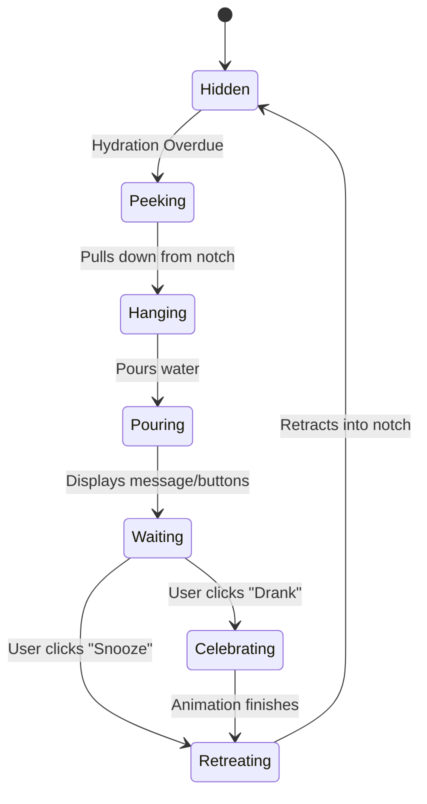

# 🐵 NotchMascot Hydration App Concept

A playful, native macOS hydration reminder that lives in your notch.

````carousel

<!-- slide -->

<!-- slide -->

````

## 🎬 Signature Interaction

1. **The Peeking Phase**: The Mac's notch seamlessly extends downward, morphing into a tiny portal. A cute 3D monkey peeks out.
2. **The Swing & Pour**: The monkey grabs the edge, swinging out with a satisfying spring-based motion. It magically produces a tiny jug and pours water into a transparent glass.
3. **The Nudge**: A subtle speech bubble appears: *"Hehe… paani pilo 💧"* (Customizable).
4. **The Celebration**: Once the user clicks **Drank 💧**, the monkey does a little jump, sparkles appear, and it happily climbs back into the notch, which retracts smoothly.

## 🎨 Visual Details & Physics

- **Aesthetic**: Pixar-level 3D charm mixed with premium macOS translucency. The character features soft geometries, slightly oversized head, and soft materials.
- **Physical Attachment**: The notch stretches slightly to accommodate the monkey’s weight.
- **Physics**: Uses natural easing, spring-based swinging (with subtle body swaying), and realistic water droplet simulation.

> [!TIP]
> **Minimal Intrusion:** The interaction is designed to be a "5-second visit." It lives tightly around the menu bar area and avoids obstructing the user's active workspace.

## ⚙️ Technical Architecture (macOS Native)
- **Frameworks**: SwiftUI / AppKit, with SceneKit or Metal for rendering the high-quality 3D mascot.
- **State Machine**: The mascot's states (Idle, Peeking, Pouring, Celebrating, Retreating) will be decoupled from the actual character models.
- **Extensibility**: Laying the foundation for future mascots (Cats, Penguins, Blobs) using a unified animation & physics controller.


