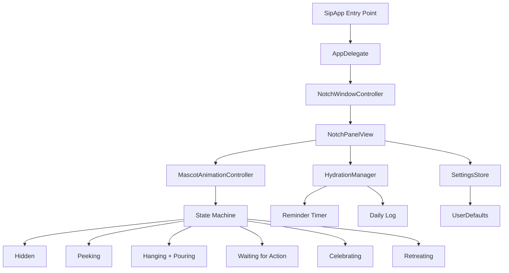

# 🫧 Sip – Build Plan

> A world-class macOS notch hydration reminder. Minimal. Smooth. Alive.

## 🏗️ Architecture Overview



## 📦 Module Breakdown

| Module | File | Responsibility |
|---|---|---|
| App Entry | `SipApp.swift` | SwiftUI App lifecycle, no dock icon |
| Window | `NotchWindowController.swift` | Transparent NSPanel anchored to notch |
| Main UI | `NotchContentView.swift` | Root SwiftUI view, state-driven |
| Mascot | `MascotView.swift` | 2D SwiftUI animated mascot (monkey) |
| Animation | `AnimationController.swift` | Spring physics, sequenced transitions |
| Hydration | `HydrationManager.swift` | Timer, streak, daily log |
| Settings | `SettingsView.swift` | Interval, goal, mascot theme |
| Persistence | `SettingsStore.swift` | UserDefaults wrapper |
| Menu Bar | `MenuBarController.swift` | Tiny status item for quick access |

## 🎬 Animation State Machine

```
Hidden ──[timer fires]──▶ Peeking (notch extends, eyes peek)
Peeking ──[1.5s]──▶ Hanging (mascot drops, grabs notch edge)
Hanging ──[0.8s]──▶ Pouring (water animation + message)
Pouring ──[auto]──▶ Waiting (buttons appear: Drank 💧 / Snooze 😴)
Waiting ──[Drank]──▶ Celebrating (sparkles, jump, streak++)
Waiting ──[Snooze]──▶ Retreating (sad wave)
Celebrating ──[1.2s]──▶ Retreating
Retreating ──[0.8s]──▶ Hidden (notch retracts)
```

## 🎨 Design System

- **Font**: SF Pro Rounded (system)
- **Colors**: Pure blacks/whites with `.ultraThinMaterial` blur
- **Radius**: 24pt (notch pill shape)
- **Mascot**: 2D SwiftUI vector (no SceneKit dependency = faster, lighter)
- **Motion**: `spring(response: 0.5, dampingFraction: 0.7)` throughout
- **Notch Panel**: `NSPanel` with `NSWindowStyleMask.nonactivatingPanel`, level `.statusBar + 1`

## 🛠️ Tech Stack

- **SwiftUI** – all UI (replaces SceneKit for mascot → lighter, smoother)
- **AppKit** – NSPanel for notch window positioning
- **Combine** – reactive state from HydrationManager
- **UserDefaults** – settings persistence
- **CoreGraphics** – water drop particle drawing

## 📋 Build Phases

### Phase 1 – Foundation ✅ (existing scaffolding)
- [x] Project structure
- [x] Package.swift (macOS target)
- [x] AppDelegate shell
- [x] HydrationManager shell

### Phase 2 – Window & Notch Anchoring 🔨
- [ ] `NotchWindowController` – transparent NSPanel at notch position
- [ ] Auto-repositions on display change
- [ ] Notch pill shape with blur background

### Phase 3 – Mascot & Animations 🎭
- [ ] SwiftUI monkey mascot (vector, no SceneKit)
- [ ] State machine transitions with spring animations
- [ ] Water pour animation (animated drops)
- [ ] Sparkle celebration particles

### Phase 4 – Hydration Logic ⏱️
- [ ] Configurable reminder interval (30min default)
- [ ] Daily water goal tracking (8 glasses)
- [ ] Streak counter
- [ ] Snooze (5 / 10 / 15 min)

### Phase 5 – Settings & Menu Bar 🎛️
- [ ] Menu bar icon with progress ring
- [ ] Settings popover (interval, goal, theme)
- [ ] Launch at login toggle
- [ ] Notification Center fallback

### Phase 6 – Polish & Ship 🚀
- [ ] App icon
- [ ] Onboarding flow
- [ ] Accessibility (reduce motion)
- [ ] DMG build script
