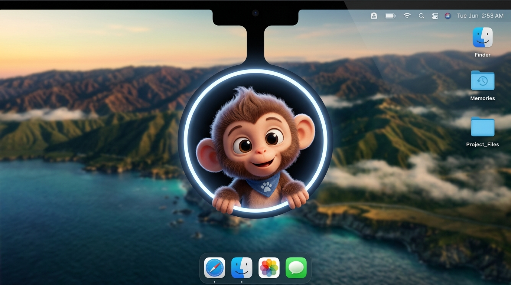

# 🫧 Sip — macOS Notch Hydration Reminder

> *"Hehe… paani pilo 💧"*

A delightful macOS Menu Bar app where a playful monkey mascot peeks out of your Mac's notch to remind you to stay hydrated.



## ✨ Features

- 🐵 **Animated Monkey Mascot** — Peeks from the notch, pours water, celebrates with sparkles
- 💧 **Smart Hydration Tracking** — Tracks glasses per day with streak counter
- ⏱️ **Configurable Reminders** — 15/30/45/60min intervals with active hour scheduling
- 😴 **Snooze** — 5/10/15 minute snooze options
- 📊 **Menu Bar Progress** — Water drop icon with circular hydration progress ring
- 🎨 **Minimal Notch UI** — Smooth spring animations, `.ultraThinMaterial` blur, 60fps

## 🚀 Getting Started

### Prerequisites

- macOS 13.0 (Ventura) or later
- Xcode 15+
- [XcodeGen](https://github.com/yonaskolb/XcodeGen): `brew install xcodegen`

### Build Steps

```bash
# 1. Clone the repo
git clone https://github.com/Sanikadalal/-Hydration_SIP.git
cd -Hydration_SIP

# 2. Install XcodeGen (if not installed)
brew install xcodegen

# 3. Generate Xcode project
xcodegen generate

# 4. Open in Xcode
open Sip.xcodeproj

# 5. Build & Run (⌘R)
```

## 🏗️ Architecture

```
Sources/
├── SipApp.swift              # @main entry point
├── AppDelegate.swift         # App lifecycle, window/menu bar setup
├── NotchWindowController.swift  # NSPanel anchored to notch
├── NotchContentView.swift    # Root SwiftUI view (state-driven)
├── MascotView.swift          # 2D SwiftUI animated monkey
├── SparkleView.swift         # Celebration particles
├── HydrationManager.swift    # State machine + timer logic
├── SettingsStore.swift       # UserDefaults persistence
├── MenuBarController.swift   # NSStatusItem + progress ring
├── SettingsView.swift        # Settings UI
└── Resources/                # Images, assets
```

## 🎬 Mascot State Machine

```
Hidden ──[timer]──▶ Peeking ──▶ Hanging ──▶ Pouring ──▶ Waiting
                                                            │
                                              ┌─────────────┴──────────────┐
                                          [Drank 💧]                  [Snooze 😴]
                                              │                            │
                                          Celebrating               Retreating
                                              │                            │
                                          Retreating                   Hidden
                                              │
                                           Hidden
```

## 📄 Docs

- [PLAN.md](PLAN.md) — Build phases and architecture
- [SPEC.md](SPEC.md) — Full product specification
- [Hydration_App_Concept.md](Hydration_App_Concept.md) — Original concept

## 📜 License

MIT © Sanika Dalal
